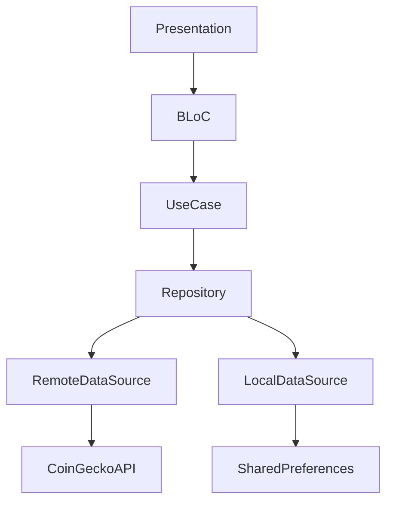
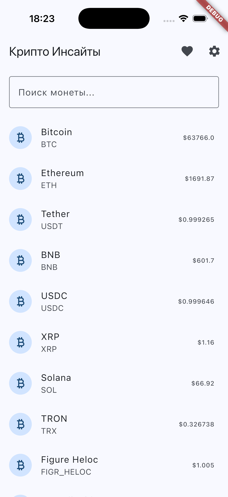
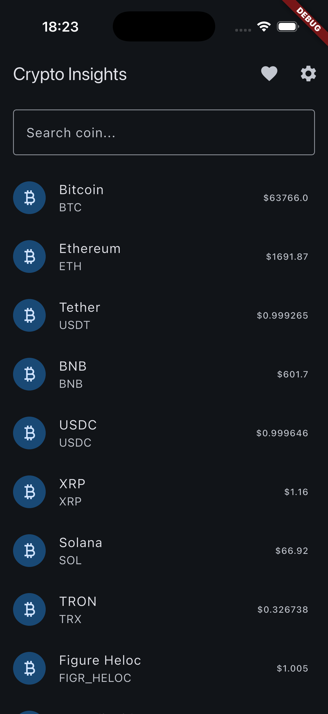
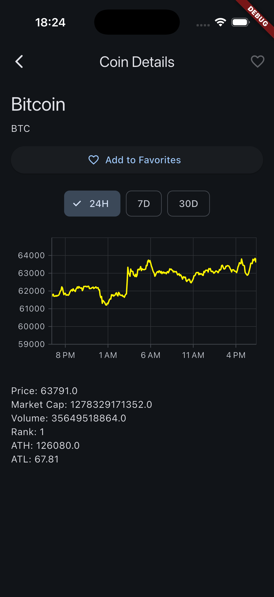
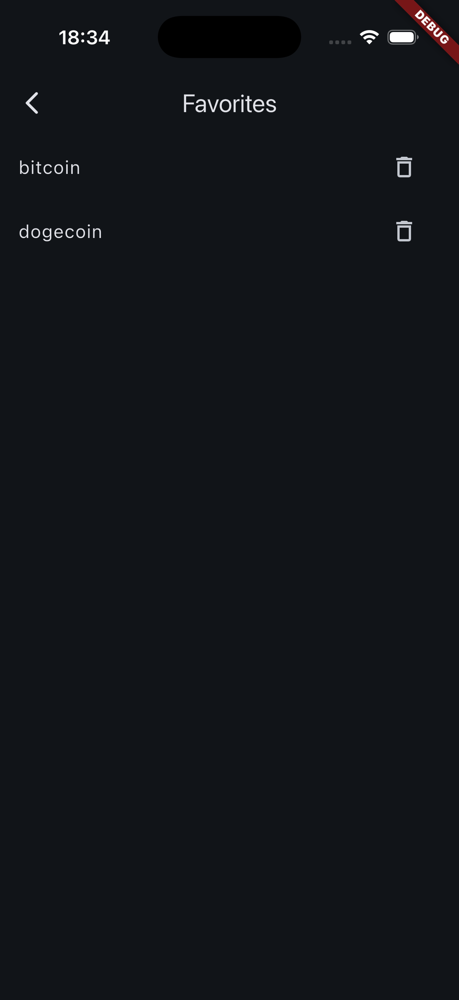
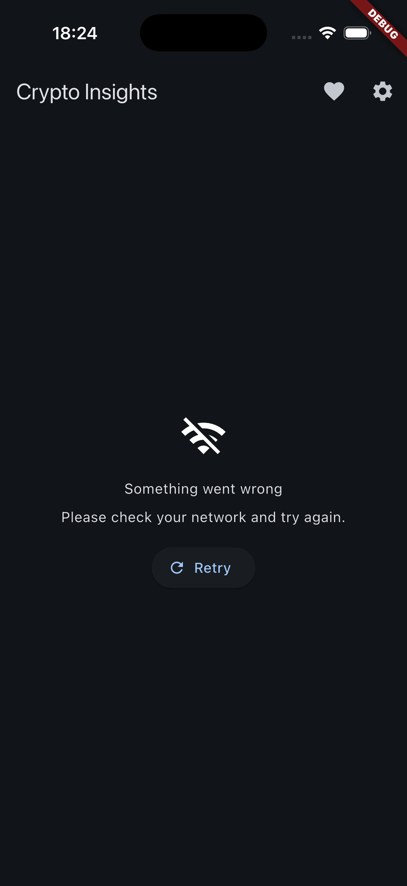

# Crypto Insights

A Flutter application for tracking cryptocurrency prices using the CoinGecko API.

## Features

### Cryptocurrency List
- Top 100 cryptocurrencies from CoinGecko API
- Search by coin name and symbol
- Pull-to-refresh
- Loading skeletons
- Empty state handling
- Error state handling
- Retry action on failed requests

### Coin Details
- Detailed coin information
- Price chart (24H / 7D / 30D)
- Market Cap
- Trading Volume
- All-Time High (ATH)

### Favorites
- Add coins to favorites
- Remove coins from favorites
- Local persistence using SharedPreferences

### Settings
- Light Theme
- Dark Theme
- System Theme
- English Localization
- Russian Localization
- Theme persistence
- Locale persistence

### Architecture & Quality
- Clean Architecture
- BLoC State Management
- Dependency Injection (Injectable + GetIt)
- AutoRoute Navigation
- Repository Pattern
- 60-second in-memory cache
- Unit Tests
- Widget Tests

## Architecture



## Project Structure

```text
lib/
├── app
│   ├── bloc
│   │   ├── locale
│   │   └── theme_mode
│   ├── di
│   └── router
│
├── core
│   ├── error
│   ├── network
│   └── theme
│
├── feature
│   ├── coins
│   │   ├── bloc
│   │   ├── data
│   │   │   ├── datasource
│   │   │   ├── models
│   │   │   └── repositories
│   │   ├── domain
│   │   │   ├── entities
│   │   │   ├── repositories
│   │   │   └── usecases
│   │   └── presentation
│   │
│   ├── coin_detail
│   │   ├── data
│   │   │   ├── datasources
│   │   │   ├── models
│   │   │   └── repositories
│   │   ├── domain
│   │   │   ├── entities
│   │   │   ├── repositories
│   │   │   └── usecases
│   │   └── presentation
│   │       ├── bloc
│   │       └── pages
│   │
│   ├── favorites
│   │   ├── bloc
│   │   ├── data
│   │   ├── domain
│   │   └── presentation
│   │
│   └── settings
│       └── presentation
│
├── l10n
│   ├── app_en.arb
│   ├── app_ru.arb
│   └── app_localizations.dart
│
└── main.dart


## Tech Stack

- Flutter
- flutter_bloc
- Dio
- Injectable
- GetIt
- AutoRoute
- SharedPreferences
- CachedNetworkImage
- CoinGecko API

## Notes

- Coin data is fetched from the public CoinGecko API.
- A 60-second in-memory cache was implemented for coin details to reduce duplicate requests and avoid CoinGecko API rate limits.
- CoinGecko image CDN may occasionally fail to load coin icons on macOS desktop and iOS Simulator due to SSL handshake issues.
- Fallback image rendering is implemented when image loading fails.

## Verified Platforms

- iOS Simulator
- macOS
- Chrome

## Getting Started

### Install dependencies

```bash
flutter pub get
```

### Generate code

```bash
flutter pub run build_runner build --delete-conflicting-outputs
```

### Run application

```bash
flutter run
```

## Testing

```bash
flutter test
```

## Screenshots

### Light Theme



### Dark Theme



### Coin Detail



### Favorites



### Offline State

